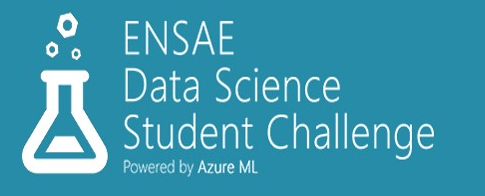
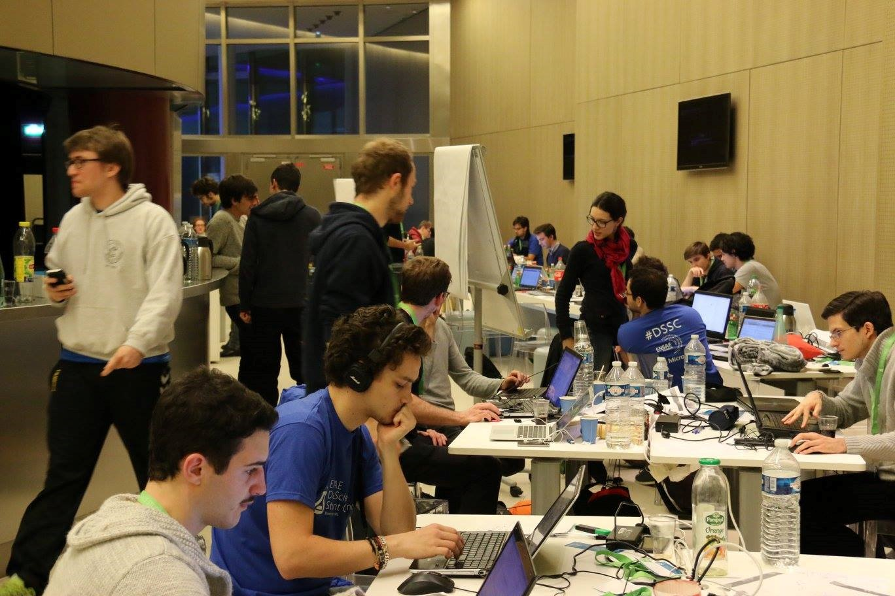
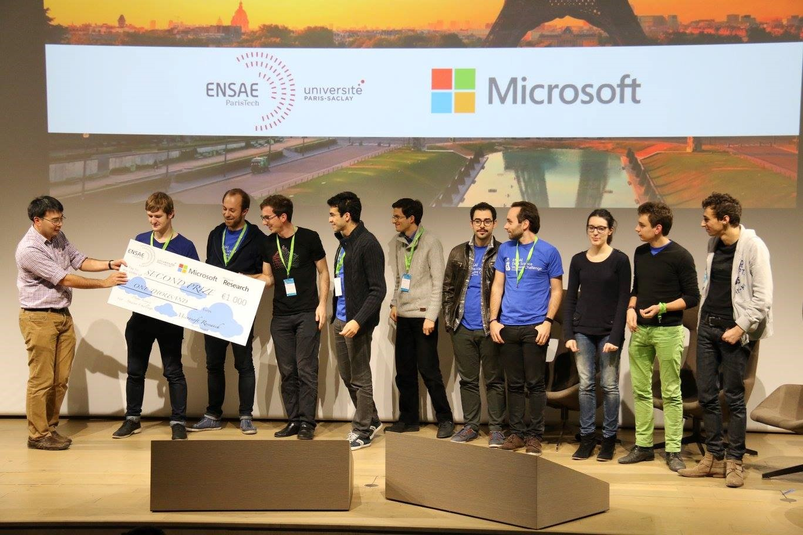
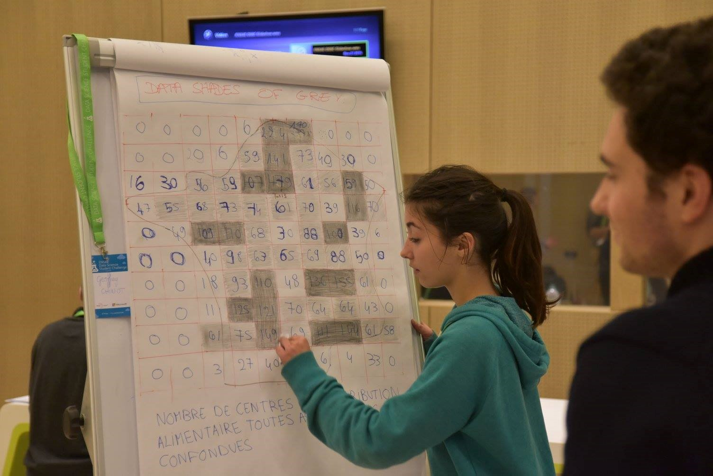
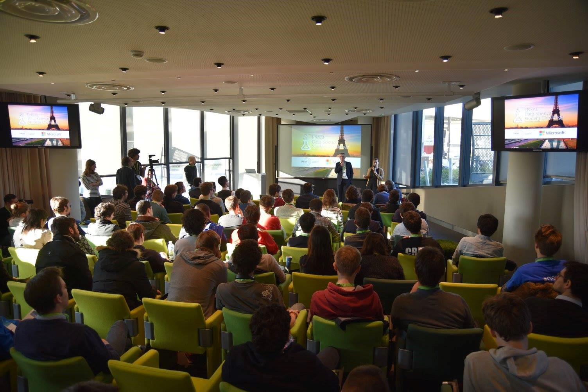

.. _l-hackathon-2015:

Hackathon Microsoft / ENSAE / Croix-Rouge / DataForGood - 2015
==============================================================

.. index:: Microsoft, ENSAE, Hackathon, Croix-Rouge, DataForGood, 2015

The hackathon was sponsored by `Microsoft <https://www.microsoft.com/>`_,
the participants were
`ENSAE <http://www.ensae.fr/ensae/>`_'s students
and they worked on data from La `Croix-Rouge <http://www.croix-rouge.fr/>`_.
See `Hackathon <http://variances.eu/?p=146>`_,
`photos <https://www.facebook.com/dsschack/photos/a.1300790849947281.1073741831.1249117758447924/1300793259947040/>`_,
`vidéo <https://www.youtube.com/watch?v=Y1UKAbbExn8>`_.

.. contents::
    :local:

Hackathon
+++++++++

Données et challenge
^^^^^^^^^^^^^^^^^^^^

.. toctree::
    :maxdepth: 2

    hackathon_2015_croix_rouge_schema
    hackathon_2015_croix_rouge_objectives

Autres données
^^^^^^^^^^^^^^

* `dataforgoodfr/croixrouge <https://github.com/dataforgoodfr/croixrouge/tree/master/data>`_
* `Description des tables INSEE <https://github.com/dataforgoodfr/croixrouge/wiki/Description-des-tables-INSEE>`_        		
* Geocoding using Bing Maps : `python-omgeo <https://pypi.python.org/pypi/python-omgeo>`_
* Geocoding using Google Maps : `google-maps-services-python <https://github.com/googlemaps/google-maps-services-python>`_

Documentation
+++++++++++++

.. _l-cr-pwd:

Comment démarrer ?
^^^^^^^^^^^^^^^^^^

Les tables sont grandes, plus de 10 Go, il est quasiment impossible de les charger en mémoire.
Votre ordinateur n'est pas assez puissant mais ce n'est pas un problème,
il suffit de démarrer une machine virtuelle sur Azure, assez puissante,
pour commencer à regarder les données.
Vous pouvez regarder la section suivante pour voir comment faire.

.. toctree::
    :maxdepth: 2

    hackathon_2015_startup

Helpers, notebooks and passwords
^^^^^^^^^^^^^^^^^^^^^^^^^^^^^^^^

The two following notebooks requires access to an Azure Blob Storage.
The credentials to access it can be stored in environment variable ``CRCREDENTIALS``
with following format::

    <blob storage name>**<access key>

Encrypted data available in this module can be accessed setting up
environment variable ``PWDCROIXROUGE`` with with password.

.. toctree::
    :maxdepth: 1

    ../notebooks/upload_donnees
    ../notebooks/database_schemas
    ../notebooks/download_data_azure
    ../notebooks/process_clean_files

Cheat Sheets
^^^^^^^^^^^^

.. toctree::
    :maxdepth: 1

    ../notebooks/chsh_graphs
    ../notebooks/chsh_files
    ../notebooks/chsh_dates
    ../notebooks/chsh_pip_install

Un peu plus sur Azure
^^^^^^^^^^^^^^^^^^^^^

* `La bible du hackatonien sur Azure <https://github.com/benjguin/UnlockLuxury/tree/master/doc>`_
* `Provision the Microsoft Data Science Virtual Machine <https://azure.microsoft.com/en-us/documentation/articles/machine-learning-data-science-provision-vm/>`_
* `SQL DataWarehouse, Azure Machine Learning, Jupyter, Power BI <http://blog.3-4.fr/2015/11/27a/sqldw-azureml-jupyter-powerbi.html>`_
* `Azure PASS <http://aka.ms/azurepassnovembre2015>`_
* `SQL DataWarehouse, Azure Machine Learning, Jupyter, Power BI <http://blog.3-4.fr/2015/11/27a/sqldw-azureml-jupyter-powerbi.html>`_

Fusion des données de la La Croix Rouge avec d'autres
+++++++++++++++++++++++++++++++++++++++++++++++++++++

* `geocoder <https://pypi.python.org/pypi/geocoder>`_
* `dataforgoodfr/croixrouge <https://github.com/dataforgoodfr/croixrouge/tree/master/data>`_
* `Description des tables INSEE <https://github.com/dataforgoodfr/croixrouge/wiki/Description-des-tables-INSEE>`_        		
* Geocoding using Bing Maps : `geopy <https://pypi.python.org/pypi/geopy/>`_ (fonction uniquement en Python 2.7)

Agenda
++++++

Lieu : `Centre de Conference Microsoft <https://www.facebook.com/pages/Centre-de-Conference-Microsoft/131714796879344>`_

Agenda vendredi 27 novembre

* 14h00 - Introduction Pierre-Louis Xech
* 14h05 - Julien Pouget, directeur de l'ENSAE
* 14h15 - Kenji Takeda
* 14h25 - Jean-François Recco, Lauriane Nicol - BioCycle - le monde caritatif et l'importance des données
* 14h35 - Laurent Monnet - Croix-Rouge - présentation et enjeux
* 14h50 - DataForGood - un peu plus sur les données
* 15h05 - Question / Réponses
* 15h25 - tutorials - début du hackathon
* 15h30 - Xavier Dupré - accès aux données
* 15h40 - Benjamin Guinebertière - Azure tutorial

Agenda samedi 28 novembre

* 17h00 - fin du hackathon
* 17h20 - jury
* 18h20 - délibération
* 18h40 - remise des prix
* 20h00 - afterwork

Retour sur la compétition
+++++++++++++++++++++++++

* Article paru dans `Variance <http://variances.eu/>`_ :
  `Le premier hackathon organisé par l'ENSAE et Microsoft sur les données de la Croix-Rouge <http://variances.eu/?p=146>`_

La définition de la problématique décrite comme une compétition était identique pour
tous les participants puisqu'il fallait produire le même type résultat à savoir
une prédiction à 15 jours du nombre de bénéficiaires attendus dans chaque unité
de distribution. Mais les différents chemins suivis, les études menées sur les données pour
valider telle ou telle hypothèse ont tout autant apporté d'enseignements dans la
façon d'aborder le problème que la qualité de la prédiction finale. Cette phase
exploratoire *en parallèle*, ludique, qui n'était ni l'application d'un cours,
ni un travail au sens où il n'y avait pas d'obligation de résultats, a produit
beaucoup d'idées qui seront assemblées lors de la conception du modèle
prédictif final.

Quelques enseignements tirés du hackathon qui donne un aperçu des paramètres
pris en compte par les participants pour construire leur modèle de prédiction.
Un groupe a étudié la récurrence de certains bénéficiaires, si on restreint la
population à ces candidats réguliers, la prédiction est nettement meilleure.
Un centre peut fermer temporairement, les bénéficiaires se répartissent ailleurs,
chez la Croix-Rouge ou chez une autre association. C'est pourquoi il apparaît
plus simple de prédire d'abord sur de grandes régions puis de propager la
prédiction centre par centre. Ce même procédé d'agglomération peut être utilisé pour le
temps : on prédit d'abord à la semaine puis on répartit cette prédiction pour chaque
jour de la semaine. Les séries agrégées sont moins bruitées.

Vidéo
+++++

.. youtube:: https://www.youtube.com/watch?v=Y1UKAbbExn8

.. image:: MSFT_logo_rgb_C-Gray.png
    :wdith: 200

Photos
++++++

Après une nuit quasiment sans dormir, on ressemble un peu à ça :

