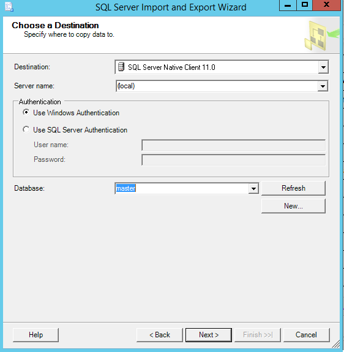
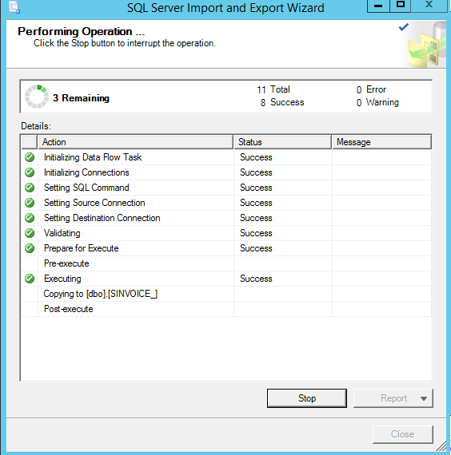

.. index:: Microsoft, ENSAE, Hackathon, Croix-Rouge, DataForGood, 2015

Getting started
===============

.. contents::
    :local:

Démarrer une machine virtuelle
++++++++++++++++++++++++++++++

Azure propose toute une série de machine virtuelle préconfigurées.
Celle qui nous intéresse doit avoir un serveur SQL qui va recevoir les données
et nous permettre de rapidement les consulter.

Il suffit de suivre les étapes suivantes.
L'ensemble prend environ 20 minutes.

**Retenez bien le nom et le mot de passe
que vous enregistrez à cette étape, ils vous seront demandé
lors de votre connexion à la machine virtuelle.**

**Il est préférable de choisir une machine virtuelle avec plus de 10 Go de mémoire
pour ce hackathon.**

A la fin de la dernière étape, le fichier ``<nom de la machine>.rdp``
sera téléchargé. Il faut l'ouvrir pour avoir accès à sa machine virtuelle.
Vous vous connectez en entrant votre nom et votre mot de passe.

Raccourci utile : ``Window + s`` pour faire apparaître la recherche sur le côté droit de l'écran.

**Pensez à éteindre la machine virtuelle à la fin du hackathon.
Pour cela : clic droit sur l'icone Windows en bas à gauche choisir
« Arrêter ou se déconnecter ».**

Installer Python sur la machine virtuelle
+++++++++++++++++++++++++++++++++++++++++

Ce n'est pas une étape obligatoire mais cela pourra vous aider
à utiliser les exemples disponibles pour cet événement.

* `ENSAE Python Setup <http://www.xavierdupre.fr/enseignement/>`_

Cela prend environ 20 minutes. Ce setup inclut également `R <https://www.r-project.org/>`_.
Pour les notebooks, je vous recommande également d'installer `Firefox <https://www.mozilla.org/fr/firefox/new/>`_.
Une fois l'installation terminée, il suffit d'aller dans le répetoire ``c:\PythonENSAE`` et
de cliquer sur l'icône *Notebook*.

Il reste à installer le module `ensae_projects <http://www.xavierdupre.fr/app/ensae_projects/helpsphinx/index.html>`_.
On ouvre une fenêtre en ligne de commande :

On se place dans le répertoire ``c:\PythonENSAE\python\Scripts``, puis on écrit ::

    pip install ensae_projects

Mettre ses mots de passe dans les variables d'environnement
+++++++++++++++++++++++++++++++++++++++++++++++++++++++++++

Il est risqué de laisser un mot de passe dans un code Python ou un notebook.
Pour cela on le met dans une variable d'environnement afin qu'ils n'apparaissent jamais
de façon explicite. Pour ce hackathon, il faut deux variables d'environnement :

* ``CRCREDENTIALS`` : pour accéder aux données de la Croix-Rouge, il doit contenir la chaîne
  ``<blobname>**<blob key>``.
* ``PWDCROIXROUGE`` : mot de passe pour accéder aux données cryptées du module
  `ensae_projects <http://www.xavierdupre.fr/app/ensae_projects/helpsphinx/index.html>`_.

Ces informations vous seront transmises au début du hackathon.
Pour mettre en place ces variables d'environnement :

Puis :

Il faut penser à faire cette opération en premier afin que ces modifications soient prises en compte
par les applications comme Python.

Je vous conseille également d'effacer ces mots de passe à la fin du hackathon.

Téléchargement des données
++++++++++++++++++++++++++

Il suffit de télécharger le notebook suivant :
`Download data from Azure <http://www.xavierdupre.fr/app/ensae_projects/helpsphinx/notebooks/download_data_azure.html>`_
(en cliquant sur le lien notebook de la première ligne)
puis de suivre les instructions pour télécharger les fichiers.

Petite astuce, pour voir les extensions de fichiers, il faut :

Puis :

Ouvrir une session sur le serveur SQL
+++++++++++++++++++++++++++++++++++++

On ouvre SQL Studio :

.. image:: hack_2015_sql1.png

On se connecte en choisissant l'option *Windows Authentification** :

Et on obtient un serveur vide :

Nettoyage des données
+++++++++++++++++++++

Il est toujours préférable de nettoyer les données avant de les importer
dans la base de données car elles viennent parfois avec des formats différents,
des guillemets...

Par exemple, il est préférable de stocker une date au format ``AAAA-MM-JJ`` plutôt
que ``JJ-MM-AAAA`` car cela permet de trier facilement les données par ordre chronologique.

* :func:`convert_dates <ensae_projects.datainc.convert_dates>`
* :func:`change_encoding <ensae_projects.datainc.change_encoding>`
* :ref:`processcleanfilesrst`

Import des données dans le serveur SQL
++++++++++++++++++++++++++++++++++++++

Les exemples qui suivent n'utilisent pas les données nettoyées
mais ils le devraient.
On ouvre l'outil dédié à cette tâche :

On tombe sur :

On choisit la source ``Flat File Source`` et le fichier à importer :

On choisit la destination :

Vosu pouvez changer le type de chaque colonne :

Et ça tourne :

Pendant quelques dizaines de minutes selon la taille des données.

Exécuter une requête
++++++++++++++++++++

Le langage utilisé est le langage `SQL <https://fr.wikipedia.org/wiki/Structured_Query_Language>`_.
Les méthodes de `pandas <http://pandas.pydata.org/>`_
telles que `groupby <http://pandas.pydata.org/pandas-docs/stable/groupby.html>`_,
`join <http://pandas.pydata.org/pandas-docs/stable/merging.html>`_
sont inspirées de ce langage. Un exemple ::

    SELECT t.[CREDAT], t.[FCY], COUNT(*) AS nb_beneficiaire FROM (
        SELECT DISTINCT [CREDAT], [FCY], [BPR]
        FROM [master].[dbo].[SINVOICE_clean]
    ) AS t
    GROUP BY t.[CREDAT], t.[FCY]
    ORDER BY t.[FCY], t.[CREDAT]

Cette requête retourne le nombre de bénéficiaires par jour et par centre.

Executer la même requête depuis Python
++++++++++++++++++++++++++++++++++++++

On peut faire la même requête depuis un notebook à l'aide du
code suivant qui se découpe en deux parties. Celle qu'on exécute qu'une seule fois ::

    import pyodbc
    import pandas
    server = 'localhost'
    db = 'master'

    # Create the connection
    conn = pyodbc.connect('DRIVER={SQL Server};SERVER=' + server + ';DATABASE=' + db + ';Trusted_Connection=yes')

Celle qu'on exécute pour chaque requête ::

    sql = """
        SELECT t.[CREDAT], t.[FCY], COUNT(*) AS nb_beneficiaire FROM (
            SELECT DISTINCT [CREDAT], [FCY], [BPR]
            FROM [master].[dbo].[SINVOICE_clean]
        ) AS t
        GROUP BY t.[CREDAT], t.[FCY]
        ORDER BY t.[FCY], t.[CREDAT]
    """
    df = pandas.io.sql.read_sql(sql, conn)
    df.head()
