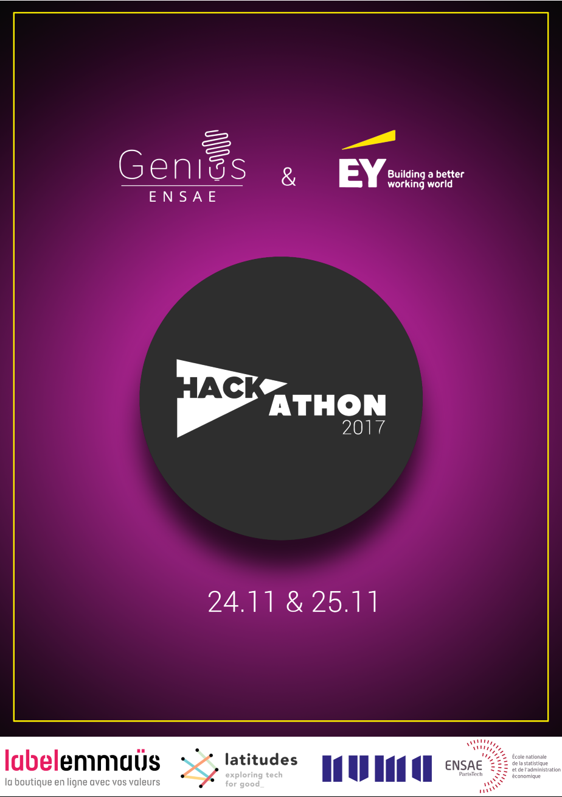

.. _l-hackathon-2017:

Hackathon Ernst & Young / ENSAE / Genius / Latitudes / Label Emmaüs / 2017
==========================================================================

.. index:: Ernst & Young, ENSAE, Hackathon, Genius, Label Emmaüs, 2017

Le hackathon était proposé et organisé par
`Ernst & Young <http://www.ey.com/fr/fr/home>`_ (sponsor),
`ENSAE <http://www.ensae.fr/ensae/fr/>`_,
`Genius <https://www.facebook.com/geniusensae/>`_,
`Latitudes <http://www.latitudes.cc/>`_,
:epkg:`Label Emmaüs`.

.. contents::
    :local:

Les données seront fournies au début de l'événement et doivent être détruites à la fin de l'événement.

Site : `hackathon-geniusensae.fr <http://hackathon-geniusensae.fr/>`_.

Version PDF : :download:`StartupKit-Hackathon-2017.pdf <StartupKit-Hackathon-2017.pdf>`.

.. image:: logo1.png

.. image:: logo2.png

Contexte
--------

:epkg:`Label Emmaüs` propose à la vente en ligne des objets
rénovés ou créés par le mouvement `Emmaüs <http://emmaus-france.org/>`_.
Son catalogue d'objets est en croissance régulière. L'ajout de
chaque objet au catalogue depuis la réception de sa désignation
(images, descriptif, entrepôt) est fait indépendamment des autres
objets. Chaque vendeur prend plusieurs photos du même objet,
ajoute une description, renseigne d'autres informations
comme sa catégorie. Au fur et à mesure que le site grossit, la qualité
des informations saisies devient prépondérant afin que
chaque utilisateur puisse facilement trouver l'objet qu'il
recherche.

:epkg:`Label Emmaüs` modèrent les annonces avant leur mise en ligne.
L'objet est entreposé jusqu'à ce qu'il soit vendu.

La détermination d'un prix comme la rédaction d'une description ne sont
pas toujours simples et il faut un peu de temps et d'expérience pour
traiter rapidement un objet. L'ajout d'un produit prend aujourd'hui
40 minutes jusqu'à la mise en ligne. Beaucoup d'objets restent aussi
très longtemps sur le site avant de trouver acquéreur et l'augmentation
du catalogue nécessite plus d'espace de stockage qui n'est pas toujours
disponible. Trois challenges ont été imaginés pour améliorer la qualité
des données proposées aux futurs acheteurs et optimiser
l'espace de stockage nécessaire.

*Pour en savoir plus :* `Label Emmaüs - qui sommes nous ? <https://www.label-emmaus.co/fr/a-propos/qui-sommes-nous/>`_

Trois défis
-----------

Les données sont mis à disposition
des participants uniquement pour la durée du hackathon
et doivent être supprimées à la fin de l'événement
de toutes les ressources utilisées pour répondre
aux défis.

Les données disponibles sont similaires à aux données
d'autres sites de vente en ligne. Il y a trois sources
d'informations : la description des produits vendus
(image, texte, attributs, catégorie, date de mise en ligne, montant),
les ventes elles-mêmes (date de vente, panier),
la composition des paniers (un panier est un acte d'achat
regroupant plusieurs produits).

Les données proposées sont anonymisées. Noms, prénoms, téléphones
sont éliminés, seul est gardé un identifiant crypté. Il n'y a pas de
données de géolocalisation excepté les adresses qui ont été tronquées
(pas de numéro de rue). Cette information a été laissée en clair afin
de pouvoir calculer une estimation de la distance entre l'acheteur
et le vendeur ayant proposé ses produits sur le site.
Les identifiants produits et panier ont été laissés
en clair afin de permettre à :epkg:`Label Emmaüs` d'exploiter les résultats
trouvés par les participants.

Challenge deep learning
^^^^^^^^^^^^^^^^^^^^^^^

    Nos compagnons passent 40' pour créer une annonce dont 30'
    sur l'identification et la qualification de l'objet. Tous
    n'ont pas les compétences pour faire ce travail
    d'identification et sont donc exclus de fait de l'accès
    à ce nouveau métier.

**Objectif**

Chaque objet est caractérisé par une ou plusieurs d'images.
Il faut déterminer la ou les catégories auxquelles il appartient.

**Les aspects auxquels le jury fera attention**

Comment Label Emmaüs pourra-t-il utiliser votre solution ? ROI ?
Y-a-t-il des objets ou des classes plus difficiles que d'autres ?
Comment votre modèle peut-il être utilisé pour proposer d'autres suggestions ?

**Pour démarrer**

`Search images with deep learning <http://www.xavierdupre.fr/app/mlinsights/helpsphinx/notebooks/search_images.html>`_ :
le notebook expose comment manipuler des
images avec :epkg:`keras` et comment utiliser le résultat des couches intermédiaires
d'un réseau de neurones profond dans le but de recherche des images similaires.

**Données**

Les données sont réparties sur quatre fichiers
qui vous seront communiqués au début du hackathon.

* Un fichier zip contenant les images (~175.000, 3.4 Go)
  de la base d'apprentissage. Si une image appartient
  à plusieurs catégories (176), elle sera dans le sous-répertoire de la catégorie
  à l'identifiant le plus élevé.
* Un fichier contenant trois colonnes *product_id,category,image_name*.
  C'est la base d'apprentissage.
* Un fichier zip contenant les images de la base de test.
* Un fichier contenent deux colonnes *product_id,image_name*.
  C'est la base de test.

Le nom de chaque image commencent par l'identifiant
produit auquel elle appartient.

**Métrique**

C'est un problème de classification multi-label :
chaque produit est associé à une ou plusieurs classes,
le plus souvent imbriquées. Un produit est associé au catégorie
``23946,23958,24038`` ce qui correspond à
*mode, mode homme, chemises*. On pourrait se contenter de ne
prédire que la dernière classe et inférer les deux premières
qui incluent la dernière mais ce n'est pas toujours le cas.
Certains livres sont rangés au rayon jeunesse et au rayon poésie.
Pour prendre en compte ces aspects, on définit une métrique
qui comptabilise le nombre de classes en commun.
On utilise une métriques définies par
`Multi-label classification <https://en.wikipedia.org/wiki/Multi-label_classification>`_
et s'appuyant sur l'indice de `Jaccard <https://en.wikipedia.org/wiki/Jaccard_index>`_.
:math:`C_i=\{c_{i1}, ..., c_{ik_i}\}` est l'ensemble
des classes à prédire pour l'objet *i*, :math:`P_i`
l'ensemble des classes prédite.

.. math::

    E = \frac{1}{n} \sum_{i=1}^n \frac{|C_i \cap P_i|}{|C_i \cup P_i|}

La fonction est implémentée par
`multi_label_jaccard <http://www.xavierdupre.fr/app/lightmlboard/helpsphinx/lightmlboard/metrics/classification.html#lightmlboard.metrics.classification.multi_label_jaccard>`_.

**Exemple de soumission**

Une fichier avec deux colonnes séparées par un point-virgule et sans en-tête.
La première contient les id de produits, la seconde votre prédiction.
Tous les id de produits de la base de test doivent être présents.
L'ordre des lignes n'a pas d'incidence.

::

    2324245;21005
    23242235;21005,22456
    3242235;21456,23555

**Lectures**

L'article n'est pas trop long et pourrait vous donner quelques idées :
`Knowledge Concentration: Learning 100K Object Classifiers in a Single CNN <https://arxiv.org/pdf/1711.07607.pdf>`_.

Challenge machine learning
^^^^^^^^^^^^^^^^^^^^^^^^^^

    Certains groupes, vendent mieux que d'autre.
    Ceux qui vendent moins bien créent moins d'annonces :
    ils ont un espace de stockage qui tend à saturer,
    l'activité n'est pas perçue comme assez performante
    pour investir. A la question "pourquoi mes produits ne
    se vendent pas", Label Emmaüs ne sait pas répondre
    (sauf par du ressenti métier).

**Objectif**

Prédire la durée entre la mise en ligne et la vente d'un objet.

**Les aspects auxquels le jury fera attention**

Comment Label Emmaüs pourra-t-il utiliser votre solution ? Quel est son ROI ?
Y-a-t-il des objets plus difficiles que d'autres ?
Comment votre prédiction évolue en fonction de cinq variables clés
(le prix, la catégorie, la distance entre l'acheteur et l'entrepôt,
le nombre de produits dans les paniers, les mots-clés dans les descriptions).

**Données**

Les données sont réparties sur plusieurs fichiers
contenant toutes les informations sur les produits,
les utilisateurs anonymisés, les paniers. Il y a deux
fichiers importants :

* Un fichier contenant les valeurs à prédire pour chaque produit,
  avec deux colonnes *product_id,days*.
  C'est la base d'apprentissage.
* Un fichier contenant des identifiants de produits de la base
  de test.

**Métrique**

C'est un problème de régression mais avec des valeurs infinies.
On aimerait qu'un produit ne reste pas plus de six mois,
c'est pourquoi un produit qui n'a pas été vendu se verra attribuer une
durée de six mois ou 180 jours. Un produit récemment ajouté mais pas encore
vendu sera considéré également comme invendu. Ceci explique l'erreur proposée :

.. math::

    E = \frac{1}{n} \sum_{i=1}^n  \frac{\min \left| Y_i - \min(f(X_i), 180) \right|}{180}

:math:`Y_i \in [0, 180]` est la valeur à prédire, elle est égale à 180
si le produit n'a pas été vendu à la date où est constitué la base de données,
:math:`f(X_i)` est la valeur prédite.
La fonction est implémentée par
`l1_reg_max <http://www.xavierdupre.fr/app/lightmlboard/helpsphinx/lightmlboard/metrics/regression_custom.html#lightmlboard.metrics.regression_custom.l1_reg_max>`_.

**Exemple de soumission**

Une fichier avec deux colonnes séparées par un point-virgule et sans en-tête.
La première contient les id de produits, la seconde votre prédiction.
Tous les id de produits de la base de test doivent être présents.
L'ordre des lignes n'a pas d'incidence.

::

    2324245;24.3
    23242233;14.3
    3242235;180

Challenge stratégique
^^^^^^^^^^^^^^^^^^^^^

    La rotation du stock dormant est un enjeu important
    (coût et limites de stockage des produits, dynamique de
    ventes sur l'activité).

**Objectif **

Imaginer des fonctionnalités qui pourraient agir sur le
stock dormant (plus de 3 mois ?) et qui respectent la charte
Emmaüs.
Tout l'enjeu du sujet est d'inciter à
l'achat tout en restant équitable.

**Contraintes de la charte Emmaüs**

Pas d'enchères ascendantes : le prix doit rester accessible à tous...
Les ventes liées ou une réduction pour l'achat de deux objets.
Chaque marchand doit être traité de façon équitable.

**Les aspects auxquels le jury fera attention**

Est-ce que les données récoltées permettent de définir le caractère équitable de Label Emmaüs ?
Comment les utilisateurs vont-ils modifier leur comportement ?
Le prix est-il le principal facteur incitatif ?

**Eléments de réflexion**

Doit-on s'adresser aux acheteurs réguliers ? A ce qui ne le sont pas ?
Doit-on les différencier ? Faut-il appliquer vos idées sur tous
les objets ou certains objets, avec un prix élevé ou simplement
encombrants, certaines saisons ? Pensez-vous à un système permanent,
ponctuel ? Le prix est-il toujours bien choisi ? Pensez-vous à
organiser une loterie pour certains acheteurs ? Des friperies ?
Peut-on recommander un objet à un utilisateur, n'est-ce pas
l'influencer ? Comment mesurer le caractère équitable du site de
vente en ligne ? Il est difficile de quantifier ce qu'une idée
peut apporter quand elle n'est pas encore mis en place. Ne peut-on
pas tout de même faire un rapprochement entre deux objets similaire,
un qui s'est vendu et un autre qui ne s'est pas vendu ?

Les enchères descendantes vérifient les contraintes imposées par Emmaüs,
cela ne risque-t-il pas d'inciter les acheteurs à attendre que les
enchères commencent ? Comment organiser une sorte de dégressivité
équitable sans diminuer l'intérêt des achteurs et des vendeurs pour
le site ? Comment créer des bundles (achat groupé) avec plusieurs
marchands sans favoriser l'un  d'eux ? Faudrait-il mutualiser
les risques et décider de la répartition du prix de la vente
avant que celle-ci ait lieu ?

**Données**

Les données sont identiques à celles du second challenge.

Préparation des données
^^^^^^^^^^^^^^^^^^^^^^^

Cette partie n'est pas essentielle à la compréhension des challenges.
Elle éclaire la façon dont les données ont été préparées pour les
challenges de machine learning et pourraient vous être utiles
pour diviser en apprentissage / test.

**Challenge 1**

Les données ont été construites à partir des images présentes
sur le site :epkg:`Label Emmaüs`. Le problème est un problème
de classification multi-label et cela complique la constitution
des bases d'apprentissage et de tests. La fonction
`train_test_split <http://scikit-learn.org/stable/modules/generated/sklearn.model_selection.train_test_split.html>`_
ne peut pas être utilisée telle quelle mais on souhaite pourtant
répartir les produits et toutes les images qui s'y réfèrent dans un
jeu ou dans l'autre mais on souhaite aussi que les petites classes
soient représentées dans les bases d'apprentissage et de tests.
Cette répartition a été effectuée avec la fonction :
`train_test_apart_stratify <http://www.xavierdupre.fr/app/pandas_streaming/helpsphinx/pandas_streaming/df/connex_split.html#pandas_streaming.df.connex_split.train_test_apart_stratify>`_.

**Challenge 2**

La préparation des données implique une séparation
jeu d'apprentissage, jeu d'évaluation. Ce dernier ne doit pas
comporter la cible à prédire. Les données  réceptionnées ont
moins d'une semaine de retard par rapport au début de l'événement.
Un produit non vendu peut l'être simplement parce qu'il n'est pas resté
assez longtemps sur le site. Intuitivement, il suffit de répartir les
données en apprentissage / évaluation selon l'identifiant produit.
Les paniers introduisent une difficulté, un :epkg:`data leakage`,
car il est possible de déduire la date de vente de tous les
produits d'un même panier à partir d'un seul. De même, si on
veut pouvoir utiliser des données utilisateurs, il faut également
avoir des utilisateurs distincts dans les deux jeux. On
considère l'ensemble des triplets
*(id produits, id personne, id panier)*. Le découpage est fait de telle
sorte qu'aucun produit n'apparaît dans les deux bases, et que les
identifiants panier et utilisateurs commun aux deux bases sont réduits.
Ce découpage est réalisé par la fonction
`train_test_connex_split <http://www.xavierdupre.fr/app/pandas_streaming/helpsphinx/pandas_streaming/df/connex_split.html#pandas_streaming.df.connex_split.train_test_connex_split>`_ :

::

    from pandas_streaming.df import train_test_connex_split
    train, test = train_test_connex_split(df, groups=["cart_id","mail","product_id"],
                                          stop_if_bigger=0.05, keep_balance=0.8,
                                          must_groups=["product_id"], test_size=0.2)

Il reste un dernier point à propos des données temporelles.
Il devient vite tentant de calculer des moyennes par utilisateur,
par produit sans tenir compte de la date à laquelle cette donnée
est produite. Il en résulte que certaines informations sont utilisées
pour prédire une valeur dans le passé.

Le fait que ce scénario ne se produit pas pourrait être vérifié
en s'assurant que les modèles produisent les mêmes résultats
avec des produits, des paniers et des utilisateurs dédoublés
mais avec des historiques tronqués. Ceci n'a pas été implémenté
par manque de temps.

Eléments de code
----------------

.. contents::
    :local:

Anti-sèches ou Cheat Sheets
^^^^^^^^^^^^^^^^^^^^^^^^^^^

* `Essential Cheat Sheets for Machine Learning and Deep Learning Engineers <https://startupsventurecapital.com/essential-cheat-sheets-for-machine-learning-and-deep-learning-researchers-efb6a8ebd2e5>`_
* `PyTorch Cheat Sheet <https://github.com/bfortuner/pytorch-cheatsheet/blob/master/pytorch-cheatsheet.ipynb>`_
* `Keras Cheat Sheet <https://s3.amazonaws.com/assets.datacamp.com/blog_assets/Keras_Cheat_Sheet_Python.pdf>`_

Autres références sur le deep learning

* `Réseaux de neurones et Deep Learning <http://www.xavierdupre.fr/app/ensae_teaching_cs/helpsphinx3/td_2a_mlplus.html#reseaux-de-neurones-et-deep-learning>`_

Récupérer des données cryptées
^^^^^^^^^^^^^^^^^^^^^^^^^^^^^^

Pour stocker un mot de passe de façon permanente :

::

    import keyring
    keyring.get_password("hackathon", "labelemmaus", "motdepasse")

Pour décoder tous les fichiers dont l'extension est ``.enc`` :

::

    from pyquickhelper.filehelper import decrypt_stream
    import keyring
    import os

    password = keyring.get_password("hackathon", "labelemmaus")

    encs = os.listdir(".")
    for enc in encs:
        if enc.endswith(".enc"):
            dest = enc[:-4]
            if not os.path.exists(dest):
                print("décrypte", enc)
                decrypt_stream(key=password.encode("ascii"), filename=enc,
                               out_filename=dest, chunksize=2**20)

Extraire des champs d'un fichier JSON
^^^^^^^^^^^^^^^^^^^^^^^^^^^^^^^^^^^^^

Le script fonctionne si votre ordinateur a assez de mémoire
pour charger toutes les données. Sinon il faudra passer
au paragraphe suivant pour faire la même chose mais en mode
streaming. Vous trouverez dans les données un exemple des informations
stockées au format JSON pour un seul produit ce qui permettra
d'ajouter facilement d'autres champs au script ci-dessous.

::

    import simplejson
    from dateutil import parser

    with open('full.json') as f:
        js = simplejson.load(f)

    fields = 'product_id|sku|produit|poids|date_created|prix|marchand|merchant_id|statut|stock|categorie|videK|sous-categorie|VideM|VideN|VideO|VideP|VideQ'
    print(fields.replace("|", "\t"))

    for p in js:
        try:
            poids = p['package_weight'].get('kg')
            if poids:
                poids = poids * 1000
            else:
                poids = p['package_weight'].get('g')
        except Exception:
            poids = ''

        created_on = ''
        try:
            created_on = parser.parse(p['created_on']).strftime('%Y-%m-%d')
        except Exception:
            pass

        values = [p['best_offer']['product']['id']),
                  p['best_offer']['sku'],
                  p.get('name',''),
                  str(poids),
                  created_on,
                  str(p['best_offer']['price_with_vat']),
                  p['best_offer']['merchant']['name'],
                  str(p['best_offer']['merchant']['id']),
                  p['best_offer']['status'],
                  str(p['best_offer']['stock']),
                  ]
        values += list(map(lambda x: x['name'], p['application_categories_dict'])
        print("\t".join(values))

Lire de gros fichiers JSON
^^^^^^^^^^^^^^^^^^^^^^^^^^

Les fichiers JSON proposés pour la compétition contiennent des informations
intéressantes mais ils sont très gros : 1 Go. Il est très difficile
de le regarder depuis un éditeur. Il faut pouvoir le lire en streaming.
C'est ce que fait le module :epkg:`ijson`. La première fonction
l'utilise pour lister les éléments du JSON fourni par :epkg:`Label Emmaüs`.
La documentation fournit un exmple d'utilisation.

.. autosignature:: ensae_projects.hackathon.json_helper.enumerate_json_items

La seconde fonction extrait des champs intéressants. Rien ne vous empêche
de récupérer le code pour extraire d'autres champs.
La documentation fournit un exmple d'utilisation.

.. autosignature:: ensae_projects.hackathon.json_helper.extract_images_from_json_2017

Visualiser du JSON
^^^^^^^^^^^^^^^^^^

Le code suivant est extrait du notebook
`Notebook, HTML, SVG, Javascript <http://www.xavierdupre.fr/app/jyquickhelper/helpsphinx/notebooks/notebook_html_svg.html#json>`_.

::

    from jyquickhelper import JSONJS
    with open("product_sample.json", "r") as f:
        js = f.read()
    import json
    rl = json.loads(js)
    JSONJS(rl)

Manipulation d'images et premiers avec le deep learning
^^^^^^^^^^^^^^^^^^^^^^^^^^^^^^^^^^^^^^^^^^^^^^^^^^^^^^^

* `Search images with deep learning <http://www.xavierdupre.fr/app/mlinsights/helpsphinx/notebooks/search_images.html>`_ :
  le notebook expose comment manipuler des images avec :epkg:`keras` et comment
  utiliser le résultat des couches intermédiaires d'un réseau de neurones profond
  dans le but de recherche des images similaires.

Cheat Sheets
^^^^^^^^^^^^

N'importe quelle requête sur un moteur de recherche
``cheat sheet + <quelque chose>`` retourne des résultats
intéressants. En voici d'autres...

.. toctree::
    :maxdepth: 1

    ../notebooks/chsh_graphs
    ../notebooks/chsh_files
    ../notebooks/chsh_dates
    ../notebooks/chsh_pip_install

`Rappel de ce que vous savez déjà mais avez peut-être oublié <http://www.xavierdupre.fr/app/ensae_teaching_cs/helpsphinx3/notebooks/td2_eco_rappels_1a.html>`_

Après la compétition
--------------------

Take Away
^^^^^^^^^

Images
^^^^^^

Vidéo
^^^^^

Agenda
^^^^^^

`Hackathon 2017 <http://www.hackathon-geniusensae.fr/>`_

Lieu : `Numa <https://paris.numa.co/>`_

*Vendredi 24 Novembre*

* 14h00 - Accueil des participants
* 15h00 - EY, ENSAE, Genius, Latitudes, Label Emmaüs
* 15h45 - Présentation des sujets
* 16h15 - Installation
* 16h30 - Début du hackathon

*Samedi 25 Novembre*

* 12h00 - jusque 15h, les mentors vous conseillent sur les présentations,
  soulignent les bonnes idées.
* 15h00 - A destination du jury, mise à disposition du code et des résultats sur GitHub,
  le leaderboard est figé.
* 16h00 - Présentation des résultats - 3 minutes de présentation + 2 minutes de questions
* 17h30 - Délibération du jury
* 18h00 - Cocktail
* 19h00 - After cocktail
