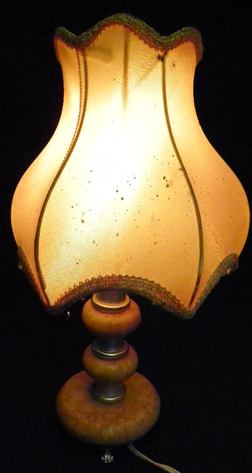

.. _l-hackathon-2017:

Hackathon Ernst & Young / ENSAE / Genius / Latitudes / Label Emmaüs / 2017
==========================================================================

.. index:: Ernst & Young, ENSAE, Hackathon, Genius, Label Emmaüs, 2017

Le hackathon était proposé et organisé par
`Ernst & Young <http://www.ey.com/fr/fr/home>`_ (sponsor),
`ENSAE <http://www.ensae.fr/ensae/fr/>`_,
`Genius <https://www.facebook.com/geniusensae/>`_,
`Latitudes <http://www.latitudes.cc/>`_,
`Label Emmaüs <https://www.label-emmaus.co/>`_.

.. contents::
    :local:

Les données seront fournies au début de l'événement et doivent être détruites à la fin de l'événement.

Site : `hackathon-geniusensae.fr <http://hackathon-geniusensae.fr/>`_.

Contexte
--------

`Label Emmaüs <https://www.label-emmaus.co/fr/>`_
propose à la vente en ligne des objets
rénovés ou créés par le mouvement
`Emmaüs <http://emmaus-france.org/>`_.
Son catalogue d'objets
est en croissance régulière. L'ajout d'un objet au catalogue
depuis la réception de sa désignation (images, descriptif, entrepôt)
n'est pas automatisé et prend de plus en plus d'importance.
Chaque vendeur prend plusieurs photos du même objet,
ajoute une description, renseigne d'autres informations
comme sa catégorie.

.. image:: 2017/image3.png
    :width: 150

Pour chaque objet, les informations sont vérifiées, classées, un prix
est fixé puis l'objet est mis en ligne et disponible à la vente.
L'objet est entreposé jusqu'à ce qu'il soit vendu.

.. image:: 2017/image4.png
    :width: 600

La détermination d'un prix comme la rédaction d'une description
ne sont pas toujours simples et il faut un peu de temps et d'expérience
pour traiter rapidement un objet. L'ajout d'un produit prend aujourd'hui
40 minutes jusqu'à la mise en ligne. Beaucoup d'objets restent aussi
très longtemps sur le site avant de trouver acquéreur et l'augmentation
du catalogue nécessite plus d'espace de stockage qui n'est pas toujours
disponible. Trois challenges ont été imaginés pour améliorer la qualité
des données proposées aux futurs acheteurs et optimiser l'espace de
stockage nécessaire.

Trois défis
-----------

Challenge deep learning
^^^^^^^^^^^^^^^^^^^^^^^

*bientôt*

Challenge machine learning
^^^^^^^^^^^^^^^^^^^^^^^^^^

*bientôt*

Challenge créatif
^^^^^^^^^^^^^^^^^

*bientôt*

Eléments de code
----------------

**Récupérer des données cryptées**

::

    from pyquickhelper.

**Manipulation d'images**

* `Search images with deep learning <http://www.xavierdupre.fr/app/mlinsights/helpsphinx/notebooks/search_images.html>`_ :
  le notebook expose comment manipuler des images avec :epkg:`keras` et comment
  utiliser le résultat des couches intermédiaires d'un réseau de neurones profond
  dans le but de recherche des images similaires.

**Cheat Sheets**

.. toctree::
    :maxdepth: 1

    ../notebooks/chsh_graphs
    ../notebooks/chsh_files
    ../notebooks/chsh_dates
    ../notebooks/chsh_pip_install

`Rappel de ce que vous savez déjà mais avez peut-être oublié <http://www.xavierdupre.fr/app/ensae_teaching_cs/helpsphinx3/notebooks/td2_eco_rappels_1a.html>`_

Après la compétition
--------------------

Take Away
^^^^^^^^^

Images
^^^^^^

Vidéo
^^^^^

Agenda
^^^^^^

`Hackathon 2017 <http://www.hackathon-geniusensae.fr/>`_

Lieu : `Numa <https://paris.numa.co/>`_

Vendredi 24 Novembre

* 14h00 - Accueil des participants
* 15h00 - EY, Latitudes, Label Emmaüs
* 15h45 - Présentation des sujets
* 16h30 - Début du hackathon

Samedi 25 Novembre

* 15h00 - Présentation des résultats
* 17h00 - Remise des prix
* 18h00 - afterwork
