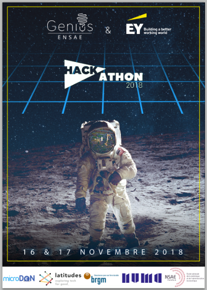

.. _l-hackathon-2018:

Hackathon ENSAE / BRGM / Microdon / Latitudes / Genius / Ernst & Young - 2018
=============================================================================

.. index:: Ernst & Young, ENSAE, Hackathon, Genius, Microdon, BRGM, 2017

Le hackathon est proposé et organisé par
`Ernst & Young <http://www.ey.com/fr/fr/home>`_ (sponsor),
`ENSAE <http://www.ensae.fr/ensae/fr/>`_,
`Genius <https://www.facebook.com/geniusensae/>`_,
`Latitudes <http://www.latitudes.cc/>`_,
:epkg:`BRGM`, :epkg:`Microdon`.
Les données seront fournies au début de l'événement
et doivent être détruites à la fin de l'événement.
Site : `hackathon-geniusensae.fr <http://hackathon-geniusensae.fr/>`_.

.. contents::
    :local:

Deux défis
----------

Le quatrième hackathon de l':epkg:`ENSAE` se prépare à ouvrir ses portes
du vendredi 16 au samedi 17. Toujours centré sur le machine Learning,
il proposera deux challenges récoltés par l'association Latitudes -
:epkg:`Latitudes` participe à la transformation de l'enseignement des ingénieurs
et des développeurs, afin de favoriser leur engagement durable sur des
projets qui œuvrent pour l'intérêt général -. Il aura lieu chez Numa, et
comme l'année dernière, il est sponsorisé par :epkg:`EY`.

Le premier défi, orienté deep Learning, s'intéressera à la
reconnaissance de dommages dans des images liées à des inondations
ou des séismes. Ce challenge est proposé par le
:epkg:`BRGM` - Le Bureau de Recherches Géologiques et Minières est l'établissement
public de référence dans les applications des sciences de la Terre pour
gérer les ressources et les risques du sol et du sous-sol -.
Le second challenge est préparé par :epkg:`Microdon` - une start-up agréée
:epkg:`ESUS` et certifiée :epkg:`B-Corp` qui propose aux entreprises soucieuses de
leur Responsabilité sociétale des solutions innovantes pour faciliter
l’engagement solidaire en entreprise -. Il s'attaquera a un problème de
prédiction de séries temporelles pas si éloigné d'ailleurs d'un des
sujets du premier hackathon organisé en 2015. Le hackathon innove
cette année pour faciliter le passage de témoin entre les participants
et les associations. Il est prévu que les prédictions des modèles
soient accessibles via une API REST afin de permettre aux porteurs de
projets de s'approprier plus facilement le travail des étudiants.

90 étudiants ont participé au hackathon l'année dernière,
70 l'année d'avant. Je confirme que certains élèves ont fait les
trois premiers hackathons et que d'autres ont récité Shakespeare.
Qui dort à 4h du matin ? A vrai dire pas grand monde, le creux
est plutôt de 5h à 7h. Il y a même parfois de grands cris de joie
car trouver un résultat à ces heures nocturnes est une gageure.
Le café de 8h est très attendu surtout par les quelques mentors qui
se disputent le titre de mentor le plus vaillant. Il faudra sans
doute dormir moins d'une heure pour espérer l'emporter.

Et pour conclure, le temps que j'écrive ces quelques mots, plus
de 90 étudiants se sont inscrits…

Challenge deep learning
^^^^^^^^^^^^^^^^^^^^^^^

Challenge machine learning
^^^^^^^^^^^^^^^^^^^^^^^^^^

Eléments de code
----------------

**Challenge deep learning**

**Challenge machine learning**

Manipulation d'images et premiers avec le deep learning
^^^^^^^^^^^^^^^^^^^^^^^^^^^^^^^^^^^^^^^^^^^^^^^^^^^^^^^

* `Search images with deep learning <http://www.xavierdupre.fr/app/mlinsights/helpsphinx/notebooks/search_images.html>`_ :
  le notebook expose comment manipuler des images avec :epkg:`keras` et comment
  utiliser le résultat des couches intermédiaires d'un réseau de neurones profond
  dans le but de recherche des images similaires.

Installer un package sur la machine virtual Azure
^^^^^^^^^^^^^^^^^^^^^^^^^^^^^^^^^^^^^^^^^^^^^^^^^

Un exemple.

::

    !/anaconda/envs/py35/bin/pip install pyquickhelper

Arrêter un process GPU
^^^^^^^^^^^^^^^^^^^^^^

La commande `nvidia-smi <https://www.microway.com/hpc-tech-tips/nvidia-smi_control-your-gpus/>`_
affiche les processus GPU qui tourne sur la machine. Si l'ordinateur ne répond plus,
il suffit d'arrêter les processus avec la commande
`kill <https://www.digitalocean.com/community/tutorials/how-to-use-ps-kill-and-nice-to-manage-processes-in-linux>`_ (processus ID) (Linux).

Après la compétition
--------------------

Photos
^^^^^^

Vidéo
^^^^^

Agenda
^^^^^^

`Hackathon 2018 <http://www.hackathon-geniusensae.fr/>`_

Lieu : `Numa <https://paris.numa.co/>`_

*Vendredi 16 Novembre*

* 14h00 - Accueil des participants
* 15h00 - EY, ENSAE, Genius, Latitudes, Microdon, BRGM
* 15h45 - Présentation des sujets
* 16h15 - Début du hackathon

*Samedi 17 Novembre*

* 15h00 - Présentation des résultats - 3 minutes de présentation + 1 minute de questions
* 17h00 - Délibération du jury
* 18h00 - Cocktail
* 19h00 - After cocktail
