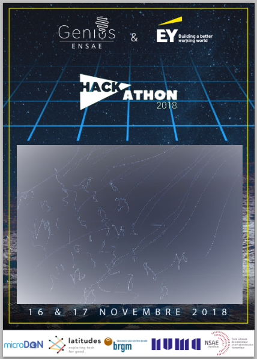
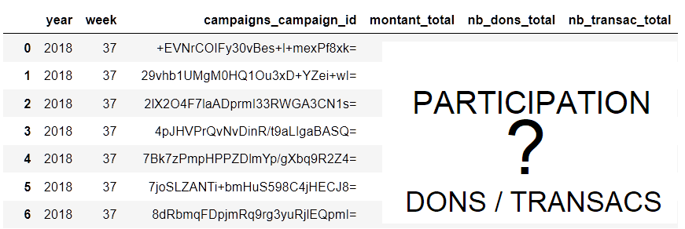

.. _l-hackathon-2018:

Hackathon ENSAE / BRGM / Microdon / Latitudes / Genius / Ernst & Young - 2018
=============================================================================

.. index:: Ernst & Young, ENSAE, Hackathon, Genius, Microdon, BRGM, 2017

Le hackathon est proposé et organisé par
`Ernst & Young <http://www.ey.com/fr/fr/home>`_ (sponsor),
`ENSAE <http://www.ensae.fr/ensae/fr/>`_,
`Genius <https://www.facebook.com/geniusensae/>`_,
`Latitudes <http://www.latitudes.cc/>`_,
:epkg:`BRGM`, :epkg:`Microdon`.
Les données seront fournies au début de l'événement
et doivent être détruites à la fin de l'événement.
Site : `hackathon-geniusensae.fr <http://hackathon-geniusensae.fr/>`_.

.. contents::
    :local:

Deux défis
----------

Le quatrième hackathon de l':epkg:`ENSAE` se prépare à ouvrir ses portes
du vendredi 16 au samedi 17. Toujours centré sur le machine Learning,
il proposera deux challenges récoltés par l'association Latitudes -
:epkg:`Latitudes` participe à la transformation de l'enseignement des ingénieurs
et des développeurs, afin de favoriser leur engagement durable sur des
projets qui œuvrent pour l'intérêt général -. Il aura lieu chez Numa, et
comme l'année dernière, il est sponsorisé par :epkg:`EY`.

Le premier défi, orienté deep Learning, s'intéressera à la
reconnaissance de dommages dans des images liées à des inondations
ou des séismes. Ce challenge est proposé par le
:epkg:`BRGM` - Le Bureau de Recherches Géologiques et Minières est l'établissement
public de référence dans les applications des sciences de la Terre pour
gérer les ressources et les risques du sol et du sous-sol -.
Le second challenge est préparé par :epkg:`Microdon` - une start-up agréée
:epkg:`ESUS` et certifiée :epkg:`B-Corp` qui propose aux entreprises soucieuses de
leur Responsabilité sociétale des solutions innovantes pour faciliter
l’engagement solidaire en entreprise -. Il s'attaquera a un problème de
prédiction de séries temporelles pas si éloigné d'ailleurs d'un des
sujets du premier hackathon organisé en 2015. Le hackathon innove
cette année pour faciliter le passage de témoin entre les participants
et les associations. Il est prévu que les prédictions des modèles
soient accessibles via une API REST afin de permettre aux porteurs de
projets de s'approprier plus facilement le travail des étudiants.

90 étudiants ont participé au hackathon l'année dernière,
70 l'année d'avant. Je confirme que certains élèves ont fait les
trois premiers hackathons et que d'autres ont récité Shakespeare.
Qui dort à 4h du matin ? A vrai dire pas grand monde, le creux
est plutôt de 5h à 7h. Il y a même parfois de grands cris de joie
car trouver un résultat à ces heures nocturnes est une gageure.
Le café de 8h est très attendu surtout par les quelques mentors qui
se disputent le titre de mentor le plus vaillant. Il faudra sans
doute dormir moins d'une heure pour espérer l'emporter.

Et pour conclure, le temps que j'écrive ces quelques mots, plus
de 90 étudiants se sont inscrits…

Challenge deep learning
^^^^^^^^^^^^^^^^^^^^^^^

La construction d'un défi n'a pas été simple pour ce challenge.
Une vue d'ensemble des images montre que les photos partagées
sur twitter illustrent des inondations sérieuses, des voitures sous
l'eau, des bateaux dans les rues. Il y a peu de photos d'intérieures
dévastés. Le problème est plus flagrant pour les séismes ou peu de
gens prennent des photos au regard du nombre de gens
qui les propagent. Cela tient sans doute à la soudaineté
de la catastrophe. Les personnes sont surprises et plongées
dans l'urgence alors qu'une inondation monte lentement et laisse
le temps de prendre des photos du danger. On part également du principe
que les gens prendront d'abord une photo d'une rivière qui monte,
puis d'une voiture ou d'une rue. Partant de ce principe, la gravité
de l'inondation est indiqué par ce que contient la photo :
une rivière ou un élément de la ville, rue ou voiture.
Le challenge doit répondre à deux questions à partir d'une image :

**L'image concerne-t-elle une inondation ou un séisme ?**

.. image:: 2018/imp.jpg
    :width: 200

La base d'images sur tweeter regroupe de nombreuses images
d'inondations ou de séimes, des cartes. A cela ont été ajoutées
des images de la base :epkg:`ImageNet` pour avoir des images
de rues non inondées assez rares dans la base récoltées par
le :epkg:`BRGM`. Des images ont été récupérées depuis l'url
suivant : `ImageNet/street <http://www.image-net.org/search?q=street>`_.
Il n'est pas interdit d'en ajouter d'autres surtout
pour obtenir des images sans inondations ou séismes qui n'ont pas
été ciblées par la méthode de sélection.
Le jeu de données fourni pour le hackathon contient :

* Les images initiales extraites de tweeter.
* Les images sans doublons extraites par une méthode statistiques.
* Des images extraites de :ref:`ImageNet` et de :ref:`Bing`
* Quelques images annotées.

La difficulté de ce challenge vient du fait que peu d'images sont
labellisées et qu'il faudra probablement augmenter la base
avec des images venant d'internet pour contrebalancer la surreprésentation
des images d'inondations.

On pourra regarder si l'image contient une voiture, une rue,
une rivière et s'en servir pour classer les images.
La base d'évaluation contient environ 200 images qu'il faudra classer
avec précision. Il y a quelques **pièges** :

.. list-table::
    :header-rows: 0
    :widths: 5 5 5 5

    * - .. image:: 2018/imn1.jpg
            :width: 150
      - .. image:: 2018/imn2.jpg
            :width: 150
      - .. image:: 2018/imn3.jpg
            :width: 150
      - .. image:: 2018/imn4.jpg
            :width: 150

La moitié des images sont dites indésirables, elles représentent
des dessins, des cartes ou des photos d'écrans.

Challenge machine learning
^^^^^^^^^^^^^^^^^^^^^^^^^^

Microdon reçoit des dons de nombreux points de collecte
pour les redistribuer ensuite à de nombreuses associations.
La base de données contient plus d'un million de lignes anonymisées
pour des dons agrégées par jour. Les huit dernières semaines vous sont
inconnues mais il faudra prédire les sommes agrégées par semaine
pour chaque campagne pour ces huit semaines manquantes, soit environ
200 valeurs. Il faut prédire le **taux de participation** d'une 
campagne agrégrée par semaine.

Le numéro de la semaine est déterminé par la fonction
`dt.week <https://pandas.pydata.org/pandas-docs/version/0.20/generated/pandas.Series.dt.week.html>`_.

Eléments de code
----------------

.. toctree::

    hackathon_2018_api_rest
    hackathon_2018_code_deep    

Après la compétition
--------------------

Photos
^^^^^^

Vidéo
^^^^^

Agenda
^^^^^^

`Hackathon 2018 <http://www.hackathon-geniusensae.fr/>`_

Lieu : `Numa <https://paris.numa.co/>`_

*Vendredi 16 Novembre*

* 14h00 - Accueil des participants
* 15h00 - EY, ENSAE, Genius, Latitudes, Microdon, BRGM, Numa
* 15h45 - Présentation des sujets
* 16h15 - Début du hackathon

*Samedi 17 Novembre*

* 15h00 - Présentation des résultats - 3 minutes de présentation + 1 minute de questions
* 17h00 - Délibération du jury
* 18h00 - Cocktail
* 19h00 - After cocktail
