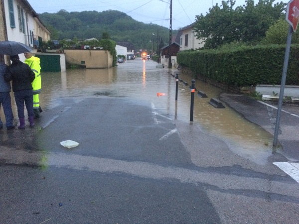

.. _l-hackathon-2018-code-deep:

Eléments de code pour le challenge 2018
=======================================

.. contents::
    :local:

Challenge
---------

A partir d'une image, un modèle de machine learning doit
déterminer si l'image représenté une zone inondée ou non
ce qui est clairement le cas dans l'image qui suit :

Ensuite, il faut déterminer si cette image représente
plutôt une rivière ou une rue, voiture ou tout autre
élément d'une ville. Ce sont donc deux classifications
binaires qu'il faut résoudre.
La moitié des images sont dites indésirables, elles représentent
des dessins, des cartes ou des photos d'écrans.

.. list-table::
    :header-row: 0
    :widths: 5 5 5 5

    * - .. image:: 2018/imn1.jpg
            :width: 150
      - .. image:: 2018/imn2.jpg
            :width: 150
      - .. image:: 2018/imn3.jpg
            :width: 150
      - .. image:: 2018/imn4.jpg
            :width: 150

Ce sont des images où il n'y bien évidemment pas d'inondations
même si elle représentent une photos d'un écran de télévision.
Celles-ci sont repérables grâce à la présence d'un logo.

Notebooks
---------

* :ref:`chshimagesrst`
* :ref:`imagesgetsrst`
* :ref:`imagesdupsrst`

Fonctions à importer ou copier/coller
-------------------------------------

Vous pouvez importer le module :epkg:`ensae_projects`
ou copier/coller le code de chaque fonction listée
à la page suivante :

* :ref:`l-hack-fct-2018`

.. code-block:: python

    # -*- coding: utf-8 -*-
    """
    Ce programme sélectionne des fichiers aléatoires dans une
    série de répertoires.
    """
    import os
    import shutil
    import re
    import random

    def random_selection(folder, pattern=".*[.]jpg$", N=1000):
        """
        Sélectionne des fichiers dans un répertoire.

        :param folder: répertoire
        :param N: nombre d'images à sélectionner
        :return: liste fichier
        """
        reg = re.compile(pattern)
        all_files = []
        for root, dirs, files in os.walk(folder):
            for name in files:
                if reg.search(name):
                    all_files.append((root, name))

        sel = random.choices(all_files, k=N)
        return [os.path.join(*_) for _ in sel]

    def copy_files(files, dest):
        """
        Copie des fichiers dans un nouveau répertoire.

        :param files: liste de fichiers
        :param dest: destination
        """
        if not os.path.exists(dest):
            os.makedirs(dest)
        for name in files:
            shutil.copy(name, dest)

    if __name__ == "__main__":
        selection = random_selection('.')
        copy_files(selection, "subset1000")

Manipulation d'images et premiers pas avec le deep learning
-----------------------------------------------------------

* `Search images with deep learning <http://www.xavierdupre.fr/app/mlinsights/helpsphinx/notebooks/search_images.html>`_ :
  le notebook expose comment manipuler des images avec :epkg:`keras` et comment
  utiliser le résultat des couches intermédiaires d'un réseau de neurones profond
  dans le but de recherche des images similaires.

Installer un package sur la machine virtual Azure
-------------------------------------------------

Un exemple.

::

    !/anaconda/envs/py35/bin/pip install pyquickhelper

Arrêter un process GPU
----------------------

La commande `nvidia-smi <https://www.microway.com/hpc-tech-tips/nvidia-smi_control-your-gpus/>`_
affiche les processus GPU qui tourne sur la machine. Si l'ordinateur ne répond plus,
il suffit d'arrêter les processus avec la commande
`kill <https://www.digitalocean.com/community/tutorials/how-to-use-ps-kill-and-nice-to-manage-processes-in-linux>`_ (processus ID) (Linux).
