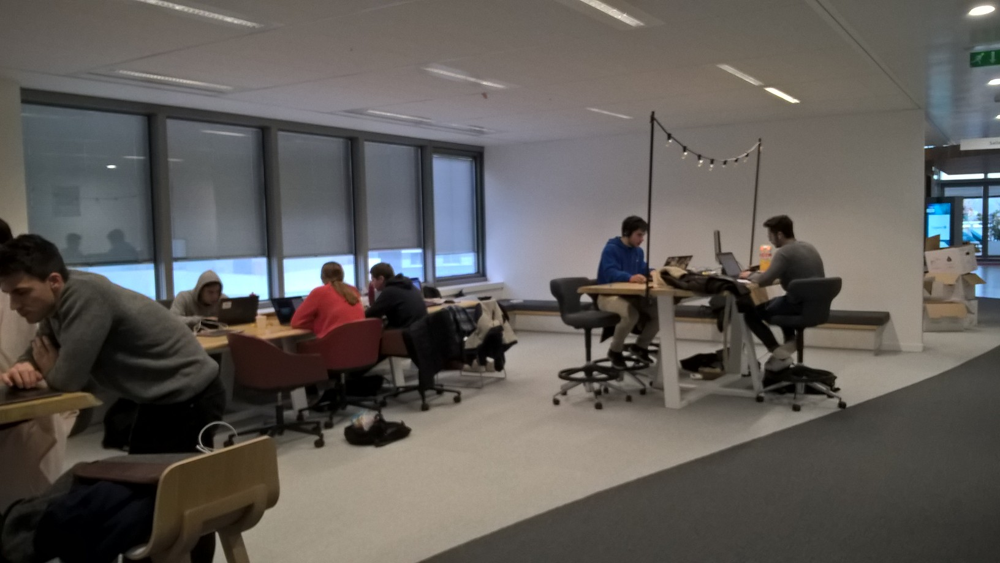
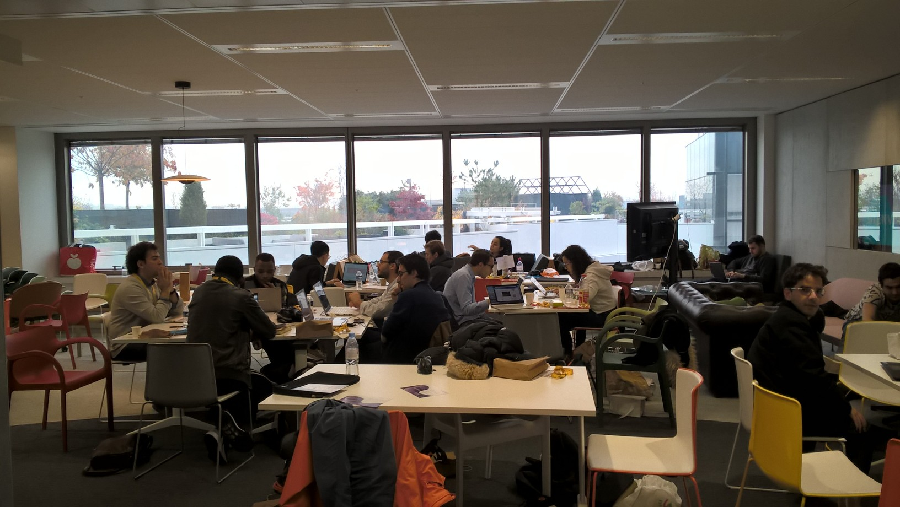
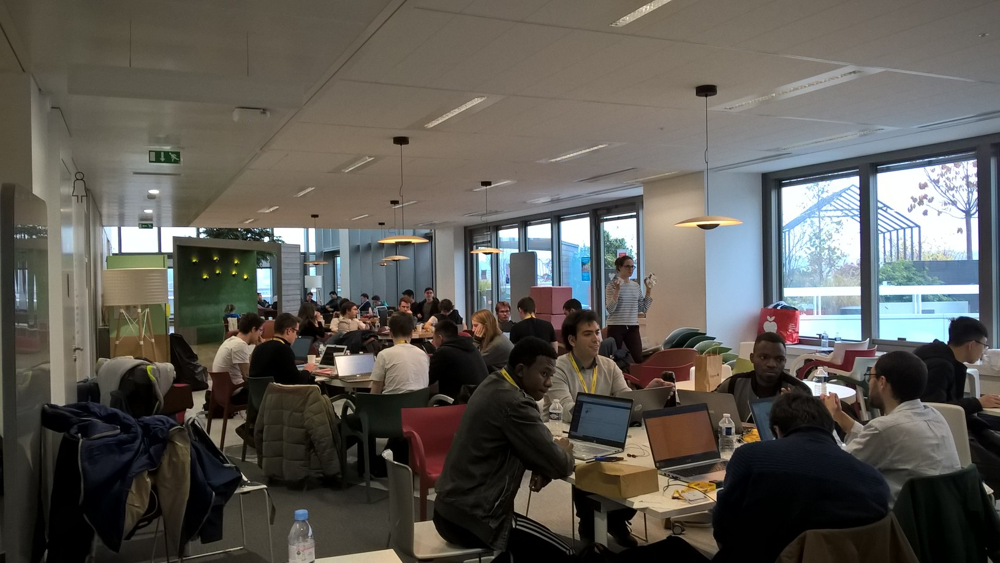

.. _l-hackathon-2019:

Hackathon ENSAE / Statup / Cap Gemini - 2019
============================================

.. index:: Cap Gemini, ENSAE, Hackathon, 2019

Le hackathon est proposé et organisé par :epkg:`Cap Gemini`
(sponsor), :epkg:`ENSAE`, *Statup*.
Les données seront fournies au début de l'événement
et doivent être détruites à la fin de l'événement.
Site : `Hackathon solidaire Capgemini - ENSAE
<https://www.capgemini.com/fr-fr/evenements/
hackathon-solidaire-capgemini-ensae/>`_.

.. contents::
    :local:

Deux défis
----------

Le cinquième hackathon de l':epkg:`ENSAE` se prépare à ouvrir ses portes
du vendredi 22 au samedi 23 novembre. Toujours centré sur le machine Learning,
il proposera deux challenges récoltés proposés par :epkg:`Cap Gemini`.
Il aura lieu chez :epkg:`Cap Gemini`.

Challenge machine learning
^^^^^^^^^^^^^^^^^^^^^^^^^^

Le premier défi est proposé par `Traumabase <http://www.traumabase.eu/fr_FR>`_.
Lorsqu'un patient subit une intervention chirurgicale grave,
il peut développer lors de sa réanimation une pneumonie.
Pour prévenir ce risque, les patients reçoivent des antibiotiques
mais cela contribue à rendre les virus plus résistants.
Prédire cette tournure permettrait de réduire leur utilisation.
Le défi s'appuie sur une base de données de 3000 patients et
130 variables saisies lors de l'arrivée des patients à l'hôpital.
Chaque patient a nécessité 20 à 40 minutes du temps d'un médecin
pour saisir ces informations. Ce défi est un problème de classification
binaire. Les participants devront soumettre leur modèle via une API
REST afin qu'ils soient exécutés sur une base de test
qui ne sera pas mise à disposition des participants.

Challenge NLP
^^^^^^^^^^^^^

Le challenge Twitter s'appuie sur une base de 600.000 tweats
concernant le cancer du sein. C'est un sujet quelque peu exploratoire
où un des sujets consiste à identifier les auteurs des tweats,
patient, médecins ou autre puis dans le cas de patients,
à identifier les différents stages de la maladie, les médicaments
utilisés pour le traitement.

Eléments de code
----------------

.. toctree::

    hackathon_2019_api_rest

Après la compétition
--------------------

*Quelques photos...*

Agenda
^^^^^^

Lieu : :epkg:`Cap Gemini`

*Vendredi 22 Novembre*

* 14h00 - Accueil des participants
* 15h00 - Cap Gemini, ENSAE, Statup...
* 15h45 - Présentation des sujets
* 16h15 - Début du hackathon

*Samedi 23 Novembre*

* 15h30 - Présentation des résultats
* 17h00 - Délibération du jury
* 17h30 - fin du hackathon
