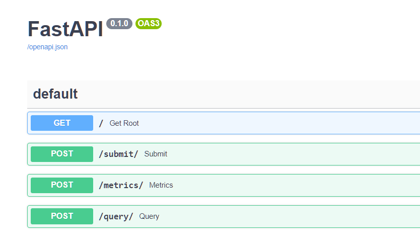
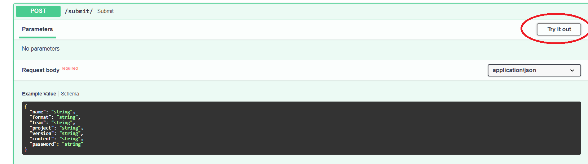
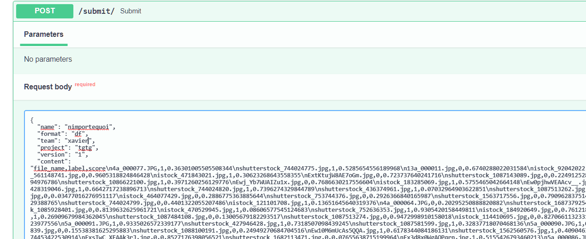
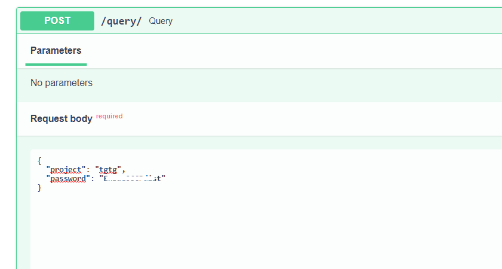

.. _l-hackathon-2020:

Hackathon ENSAE / Statup / Cap Gemini - 2020/2021
=================================================

.. index:: Cap Gemini, ENSAE, Hackathon, 2020, 2021

Plusieurs fois reporté à cause de l'épidémie,
il aura lieu en distanciel.
Le hackathon est proposé et organisé par :epkg:`Cap Gemini`
(sponsor), :epkg:`ENSAE`, *Statup*.
Les données seront fournies au début de l'événement
et doivent être détruites à la fin de l'événement.
Site : `Hackathon solidaire Capgemini - ENSAE
<https://www.capgemini.com/fr-fr/evenements/
hackathon-solidaire-capgemini-ensae/>`_.

.. contents::
    :local:

Deux défis
----------

Le cinquième hackathon de l':epkg:`ENSAE` se prépare à ouvrir ses portes
du vendredi 9 au samedi 10 avril 2021. Toujours centré sur le machine Learning,
il proposera deux challenges récoltés proposés par :epkg:`Cap Gemini`.

Challenge machine learning
^^^^^^^^^^^^^^^^^^^^^^^^^^

Proposé par `Too Good To Go <https://toogoodtogo.fr/fr>`_.

Challenge Deep Learning
^^^^^^^^^^^^^^^^^^^^^^^

Proposé par `Sea Cleaner <https://www.theseacleaners.org/fr/accueil/>`_.

Soumettre
---------

Via l'interface graphique. Suivre les instructions :

Le texte à soumettre inclut les champs suivant :

* nom : ce que vous voulez
* format : `"df"` (pour dataframe)
* team : nom de l'équipe
* project : `"tgtg"` ou `"sea"`
* password : celui donné dans Discord
* content : le contenu du DataFrame

::

    import json
    from io import StringIO

    st = StringIO()
    df.to_csv(st, index=False, line_terminator="\n")

    data = {
        "name": "xavier",
        "format": "df",
        "team": "prof",
        "project": "test",
        "password": "password",
        "content": st.getvalue(),
    }
    print(json.dumps(data))

Il suffit de recopier le résultat. L'url et le mot de passe vous seront fournis.
Ensuite, on vérifie que la soumission a été enregistrée.

Quelques scripts utiles
-----------------------

Quelques bouts de scripts utiles pour regarder les premiers éléments
sans charger l'intégralité du fichier qui est conséquent (1M de ligne, > 30 colonnes).

::

    # coding: utf-8
    from pandas_streaming.df import StreamingDataFrame

    sdf = StreamingDataFrame.read_csv("train.csv", dtype={'Département': str})
    for df in sdf:
        print(df.head())
        print(df.head().T)
        break

    print(sdf.shape)  # prend du temps car il faut parcourir tout le fichier

Pour stocker la base dans un fichier :epkg:`sqlite`.

::

    import sqlite3
    from pandas_streaming.df import StreamingDataFrame

    sdf = StreamingDataFrame.read_csv("df_target.csv", dtype={'Département': str})
    con = sqlite3.connect("tdtd2.db3")
    for i, df in enumerate(sdf):
        print(i)
        df.to_sql(con=con, if_exists="append", name="tgtd")

    con.close()

Script utilisés pour séparer train/test :

::

    import pandas
    from pandas_streaming.df import StreamingDataFrame

    def train_test_iterator(train=True):
        sdf = StreamingDataFrame.read_csv("df_target.csv", dtype={'Département': str})

        for df in sdf:
            col = df['date'].apply(lambda s: s[:7])
            sel = col < "2020-05"
            if train:
                yield df[sel]
            else:
                yield df[~sel]

    print("test")
    sdf_test = StreamingDataFrame(lambda: train_test_iterator(False))
    sdf_test.to_csv("test.csv", index=False, encoding='utf-8', line_terminator='\n')

    dft = pandas.read_csv("test.csv").reset_index(drop=False)
    dft.drop("target", axis=1).to_csv("test_features.csv", encoding='utf-8', line_terminator='\n')
    dft[["index", "target"]].to_csv("test_target.csv", encoding='utf-8', line_terminator='\n')

    print("train")
    sdf_train = StreamingDataFrame(train_test_iterator)
    sdf_train.to_csv("train.csv", index=False, encoding='utf-8', line_terminator='\n')

Example de soumission :

::

    from io import StringIO
    import json
    import pprint
    import requests
    from ensae_projects.hackathon.random_answers import random_answers_2020_images

    def submit_random(url, password, version):
        df = random_answers_2020_images()[:5]
        st = StringIO()
        df.to_csv(st, index=False, line_terminator="\n")

        data = {
          "name": "xavier",
          "format": "df",
          "team": "prof",
          "project": "test",
          "version": version,
          "content": st.getvalue(),
          "password": password
        }

        response = requests.post(url, json=data, verify=False)
        return response

    url = "https://quelquechose:8798/"
    password = "???"

    response = submit_random(url + "submit/", password, "8")
    pprint.pprint(response.json())

Vérifie que la soumission est bien passée :

::

    from io import StringIO
    import json
    import pprint
    import requests
    from ensae_projects.hackathon.random_answers import random_answers_2020_images

    def query(url, password, name):
        data = {
          "name": name,
          "password": password
        }

        response = requests.post(url, json=data, verify=False)
        return response

    url = "https://quelquechose:8798/"
    password = "???"

    response = query(url + "query/", password, "xavier")
    pprint.pprint(response.json())

