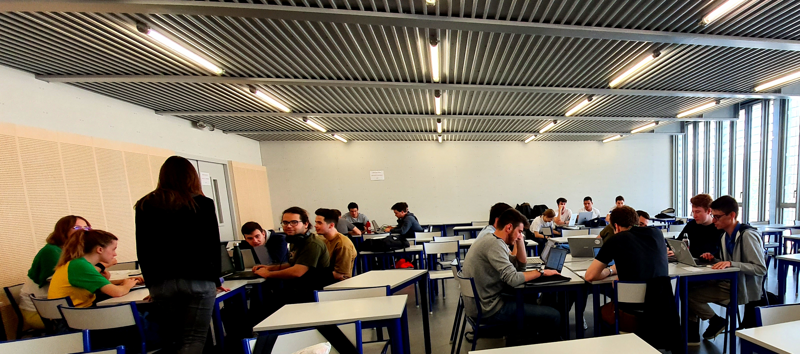
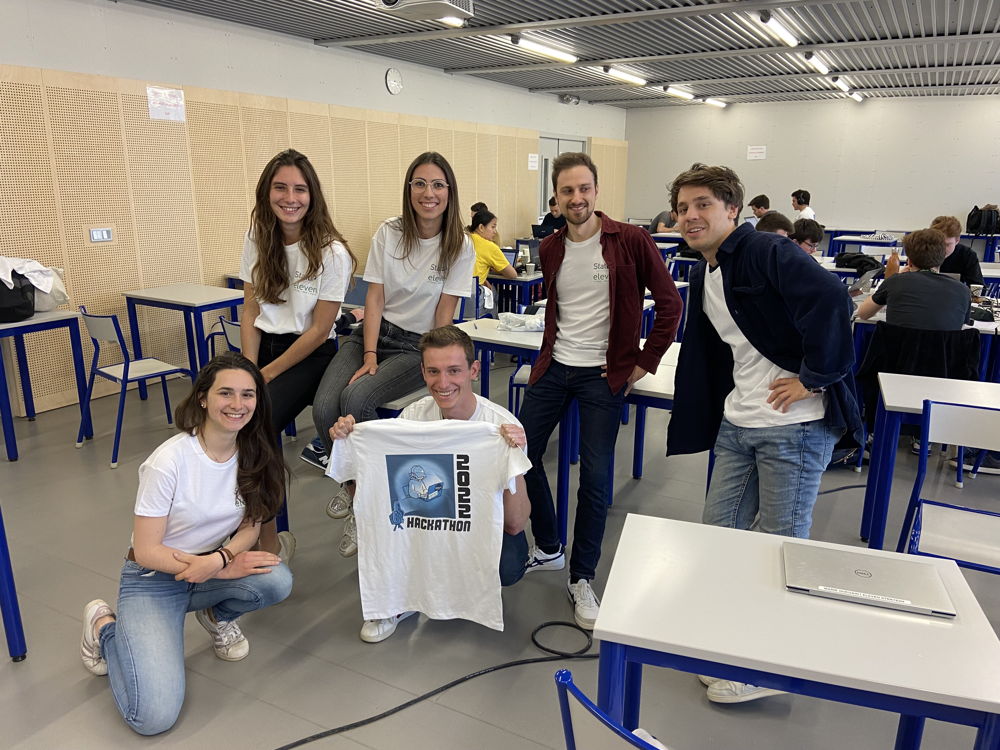
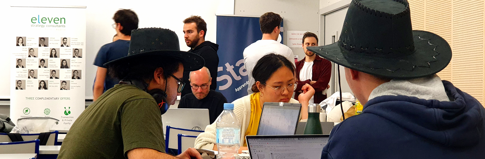
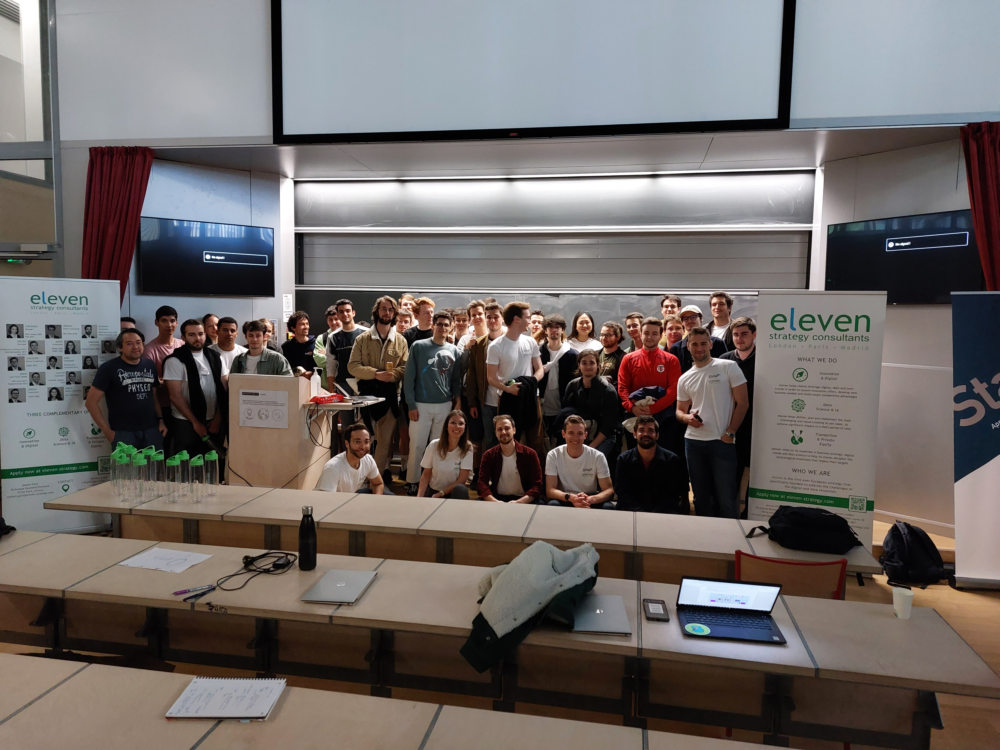

.. _l-hackathon-2022:

Hackathon ENSAE / Statup / DataForGood / Eleven Stategy - 2022
==============================================================

.. index:: Eleven Strategy, ENSAE, Hackathon, 2022

Premier hackathon en présentiel après la pandémie.
Le hackathon est proposé et organisé par :epkg:`Eleven Strategy`
(sponsor), :epkg:`ENSAE`, *Statup*.
Les données seront fournies au début de l'événement.
Le sujet a été élaboré dans le cadre d'une initiative
de :epkg:`DataForGood`.

.. contents::
    :local:

Deux défis
----------

Le cinquième hackathon de l':epkg:`ENSAE` a lieu à l'ENSAE
du vendredi 22 au samedi 21 avril 2022.
Toujours centré sur le machine Learning.

Challenge machine learning
^^^^^^^^^^^^^^^^^^^^^^^^^^

Il fallait prédire en fonction de plusieurs variables
si un film passait le test de
`Bechdel <https://fr.wikipedia.org/wiki/Test_de_Bechdel>`_
mesurant l'équilibre entre les acteurs masculins et féminins.
Les films d'actions sont plutôt misogynes.

Challenge Deep Learning
^^^^^^^^^^^^^^^^^^^^^^^

L'utilisation de :epkg:`pytorch` est recommandée. Autres modules :

* `moviepy <https://zulko.github.io/moviepy/>`_: manipuler les vidéos
* `ffmpeg <https://ffmpeg.org/>`_:
  l'outil en ligne de commande pour manipuler les vidés

::

    pip install --upgrade torch torchvision torchaudio

*Articles*

* `Who spoke when! How to Build your own Speaker Diarization Module
  <https://medium.com/saarthi-ai/who-spoke-when-build-your-own-speaker-diarization-module-from-scratch-e7d725ee279>`_
  (code `Resemblyzer <https://github.com/resemble-ai/Resemblyzer>`_)
* `Voice, speech and gender: male-female acoustic differences and cross-language variation in English and French speakers
  <https://halshs.archives-ouvertes.fr/halshs-00764811/document>`_
* `GENERALIZED END-TO-END LOSS FOR SPEAKER VERIFICATION <https://arxiv.org/pdf/1710.10467.pdf>`_
  (`code <https://github.com/Aurora11111/speaker-recognition-pytorch>`_)
* `Text to Speech <https://pytorch.org/tutorials/intermediate/text_to_speech_with_torchaudio.html>`_

*Outils*

* `diart <https://github.com/juanmc2005/StreamingSpeakerDiarization>`_
* `Awesome Speaker Diarization <https://wq2012.github.io/awesome-diarization/>`_
* `pyannote-audio <https://github.com/pyannote/pyannote-audio>`_
* `WAV2VEC2 <https://pytorch.org/tutorials/intermediate/speech_recognition_pipeline_tutorial.html>`_
* `torchaudio <https://pytorch.org/audio/stable/index.html>`_

Avec *ONNX*:

* `Speech & Audio Processing <https://github.com/onnx/models#speech--audio-processing->`_

**Windows**

La librairie `librosa <https://librosa.org/doc/latest/index.html>`_
crée des fichiers temporaires à l'endroit
où elle est installée. Il faut donner à python les mêmes droits que
ce répertoire.

**Examples**

::

    pip install git+https://github.com/pyannote/pyannote-audio.git@develop#egg=pyannote-audio
    pip install speechbrain
    pip install diart
    
L'exemple suivant fonctionne :

::

    from pyannote.audio import Pipeline
    pipeline = Pipeline.from_pretrained("pyannote/speaker-diarization")

    # apply pretrained pipeline
    diarization = pipeline("2022/maybe-next-time.wav")

    # print the result
    for turn, _, speaker in diarization.itertracks(yield_label=True):
        print(f"start={turn.start:.1f}s stop={turn.end:.1f}s speaker_{speaker}")
        
Avec `diart <https://github.com/juanmc2005/StreamingSpeakerDiarization>`_:

::

    python -m diart.demo microphone

Voir aussi :ref:`traitementdusonrst`.

Après la compétition
--------------------

J'ai bien essayé de me lancer pour isoler les interlocuteurs sur une bande
son à partir de ce que je pouvais trouver sur Internet.
Et j'ai passé trois heures à faire marcher quelque chose
car tous les exemples utilisent la librairies `librosa
<https://librosa.org/doc/latest/index.html>`_ et que celle-ci
créé des fichiers temporaires là où elle est installée.
Si par malheur, celle-ci est installée dans un endroit où il faut avoir
les droits administrateurs et que celui-ci qui l'utilise ne les a pas,
c'est l'assurance de faire face à un message d'erreur bizarre
ou une sensation de programme interminable. Bref, j'ai abandonné avant
les participants.

Je regrette de ne pas avoir pris une photo du repas dans le hall
de l'école. Le seul repas fait maison, cuisiné quelque part
dans une résidence. Incontestablement le meilleur repas que j'ai
jamais eu lors d'un hackathon.

Le retour à vélo le lendemain après avoir dormi à peine une heure
ne fut pas si difficile que cela. Après autant d'aller retour Paris
Saclay, les yeux fermés.

*Quelques photos...*

Dans la fournaise...

Le sponsor

Cherchez bien, je suis quelque part, caché dans l'une des rares filles
de ce hackathon.

A 4h du mat...

.. image:: 2022/20220423_034341.jpg
    :height: 300

Photo finale.

